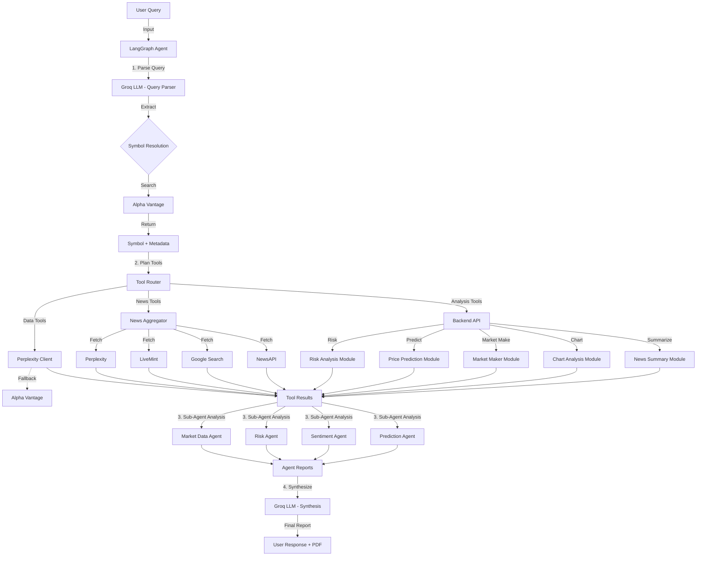

# 📈 Fin-Alpha: AI-Powered Financial Analysis Platform


**Fin-Alpha** is a state-of-the-art financial analysis agent that combines real-time market data, advanced risk metrics, and Generative AI to provide actionable investment insights.


## ✨ Key Features

* **🤖 Agentic Interface**: Chat naturally with `finalpha` to analyze stocks, ask for recommendations, and get explained insights.
* **📊 Comprehensive Analysis**:
  * **Real-time Data**: Perplexity-grounded stock/news retrieval with Alpha Vantage fallback for robustness.
  * **Technical Indicators**: RSI, MACD, Bollinger Bands, Moving Averages.
  * **Fundamental Data**: P/E, P/B, EV/EBITDA, P/S, PEG, Dividend Yield, ROE, ROA, ROIC, etc.
* **⚖️ Risk Intelligence**:
  * Value at Risk (VaR) & Conditional VaR (CVaR) calculations.
  * Volatility analysis (annualized, daily, vs sector benchmark).
  * Sharpe, Sortino, Treynor, Information ratios.
  * Maximum Drawdown & Anomaly detection.
  * Beta, Alpha, R-Squared analysis.
* **🔮 Predictive Models**:
  * Price forecasting using EMA and Linear Regression.
  * Bull/Bear/Base case scenarios.
  * Support/Resistance levels.
  * Market Making quotes (Avellaneda-Stoikov model).
* **📰 News & Sentiment**:
  * Aggregated news from Perplexity, NewsAPI, Google Search, and LiveMint.
  * AI-driven sentiment scoring and theme extraction.
  * Multi-source news analysis with credibility weighting.
* **📄 Export Capabilities**:
  * PDF report generation for analysis results.

## 🛠️ Tech Stack

* **Backend**: FastAPI, Uvicorn, Pydantic
* **AI/LLM**: Groq API (`openai/gpt-oss-20b`), LangGraph for agent orchestration
* **Data Sources**: 
  * `Perplexity API` (Primary stock/news grounding)
  * `Alpha Vantage` (Market data fallback)
  * `NewsAPI` (News aggregation)
  * `Google Search` (News via Gemini grounding)
  * `LiveMint RSS` (Indian market news)
* **Analysis**: `pandas`, `numpy`, `scipy`, `reportlab` (PDF export)
* **CLI**: `typer`, `rich`, `prompt-toolkit`

## 🔄 Architecture Overview

### High-Level Flow

```
User Query → LangGraph Agent → Sub-Agents → Tools → Backend APIs → Synthesis → Report
```

### Data Flow Diagram



## 🔌 API Call Flow

### Backend API Endpoints

| Endpoint | Method | Purpose | Returns |
|----------|--------|---------|---------|
| `/api/health` | GET | Health check | Service status |
| `/api/analyze-risk` | POST | Risk metrics calculation | Volatility, VaR, Sharpe, Drawdown, Beta, etc. |
| `/api/predict-price` | POST | Price prediction (EMA/Linear) | Predicted price, scenarios, support/resistance |
| `/api/market-maker/quote` | POST | Avellaneda-Stoikov quotes | Bid, Ask, Spread, Reservation price |
| `/api/analyze-chart` | POST | Technical chart analysis | AI-generated technical insights |
| `/api/summarize-news` | POST | News summarization | AI-generated news summary |
| `/api/analyze-news` | POST | Multi-source news analysis | Combined sentiment, themes, analysis |
| `/api/groq-query` | POST | Direct LLM queries | LLM response |
| `/api/search-analysis` | POST | Grounded stock analysis | Full analysis with search |

### Agent Tools (in `agents/tools.py`)

| Tool | Purpose | Calls |
|------|---------|-------|
| `get_stock_price` | Current quote + basics | Perplexity → Alpha Vantage |
| `get_stock_info` | Company fundamentals | Perplexity → Alpha Vantage |
| `get_financial_metrics` | Detailed ratios | Perplexity fallback |
| `get_hist_data` | OHLCV historical data | Perplexity → Alpha Vantage |
| `get_analyze_risk` | Risk metrics | Backend `/api/analyze-risk` |
| `predict_price` | Price forecasting | Backend `/api/predict-price` |
| `get_market_maker_quote` | Bid/Ask quotes | Backend `/api/market-maker/quote` |
| `get_stock_news` | Stock-specific news | LiveMint → Google → NewsAPI |
| `analyze_news_sentiment` | Sentiment scoring | Tool aggregation |
| `analyze_combined_news` | Multi-source analysis | Backend `/api/analyze-news` |
| `analyze_chart` | Technical analysis | Backend `/api/analyze-chart` |
| `summarize_news_articles` | News summary | Backend `/api/summarize-news` |
| `compare_stocks` | Multi-stock comparison | Perplexity |
| `search_grounded_analysis` | Full analysis | Perplexity |

### Sub-Agent Analysis Pipeline

Each sub-agent receives specific data and produces structured insights:

1. **Market Data Agent** → Price action, volume, valuation, technical levels
2. **Risk Agent** → Volatility, VaR, drawdown, beta, risk assessment
3. **Sentiment Agent** → News sentiment, themes, credibility analysis
4. **Prediction Agent** → Trend analysis, price targets, momentum

## 📋 Report Sections

The final report includes:

1. **Executive Summary** - Key findings + BUY/HOLD/SELL recommendation
2. **Query Context** - Timeframe, sentiment focus, news category
3. **Sub-Agent Insights** - Detailed analysis from each agent
4. **Current Market Data** - Price, market cap, P/E, volume, 52-week range
5. **Financial Metrics** - Valuation, profitability, growth, health ratios
6. **Risk Analysis** - Volatility, VaR, Sharpe, drawdown, beta
7. **Price Prediction** - Forecast, scenarios, support/resistance
8. **Sentiment Analysis** - News sentiment breakdown
9. **Market Maker Quote** - Avellaneda-Stoikov bid/ask
10. **Technical Chart Analysis** - AI technical insights
11. **News Articles** - Recent headlines with links
12. **Disclaimer** - Standard financial disclaimer

## 🚀 Getting Started

### Prerequisites

* Python 3.8+
* A Groq API key (get one at [console.groq.com](https://console.groq.com))

### Installation

1. **Clone the repository**:

   ```bash
   git clone https://github.com/yourusername/fin-alpha.git
   cd fin-alpha
   ```
2. **Set up the environment**:
   The project includes a launcher script `main.py` to automate setup and run both backend and agent.

   ```bash
   python3 main.py
   ```

   *Alternatively, manually:*

   ```bash
   python3 -m venv venv
   source venv/bin/activate
   pip install -r requirements.txt
   ```
3. **Configure Environment Variables**:
   Create a `.env.local` file:

   ```ini
   GROQ_API_KEY=your_groq_api_key_here
   GROQ_MODEL=openai/gpt-oss-20b
   PERPLEXITY_API_KEY=your_perplexity_api_key_here
   PERPLEXITY_MODEL=sonar
   ALPHAVANTAGE_API_KEY=your_alpha_vantage_api_key_here
   NEWSAPI_KEY=your_newsapi_key_here
   GOOGLE_API_KEY=your_google_api_key_here
   BACKEND_URL=http://localhost:8000
   LLM_TEMPERATURE=1
   MAX_TOKENS=2048
   ```

## 🖥️ Usage

### Running the Agent (CLI)

Start the interactive financial agent:

```bash
python3 main.py
# OR
python3 agents/run.py
```

**Example Queries:**

* *"Analyze the stock of Reliance"*
* *"What is the risk profile of Tesla?"*
* *"Compare HDFC Bank and ICICI Bank"*
* *"Get me the latest news for Apple"*
* *"Predict the price of SBI"*

### Running the Backend API

Start the FastAPI server for the REST API:

```bash
uvicorn backend.app:app --reload
```

API Documentation will be available at: `http://localhost:8000/docs`

## 🧩 Project Structure

```
fin-alpha/
├── LICENSE
├── README.md
├── main.py            # Launcher script for backend + agent
├── requirements.txt
├── .env.example       # Environment variables template
├── .env.local         # Local environment configuration
├── agents/
│   ├── __init__.py
│   ├── agent.py          # Main LangGraph agent
│   ├── config.py         # Agent configuration
│   ├── run.py            # CLI entry point
│   ├── state.py          # Agent state definition
│   ├── tools.py          # LangChain tools (17 tools)
│   ├── pdf_exporter.py   # PDF report generation
│   ├── clients/
│   │   ├── __init__.py
│   │   ├── alphavantage_client.py
│   │   ├── backend_client.py
│   │   ├── google_search_client.py
│   │   ├── mint_client.py
│   │   ├── news_api.py
│   │   └── perplexity_client.py
│   └── prompts/
│       ├── __init__.py
│       ├── agent_prompts.py
│       ├── subagent_prompts.py
│       ├── synthesis_prompts.py
│       ├── system_prompts.py
│       └── tools_prompts.py
├── backend/
│   ├── __init__.py
│   ├── app.py            # FastAPI application (14 endpoints)
│   ├── config.py         # Backend configuration
│   ├── groq_helper.py    # Groq API helper
│   ├── market_maker.py   # Avellaneda-Stoikov model
│   ├── mint.py           # LiveMint scraper
│   ├── models.py         # Pydantic models
│   ├── price_prediction.py
│   └── risk_analysis.py
├── static/
│   └── favicon.svg
```

## ⚠️ Disclaimer

This tool is for **educational and research purposes only**. It does not constitute financial advice. Always do your own due diligence before making investment decisions.

Built with ❤️ by Shreyas Pandey
