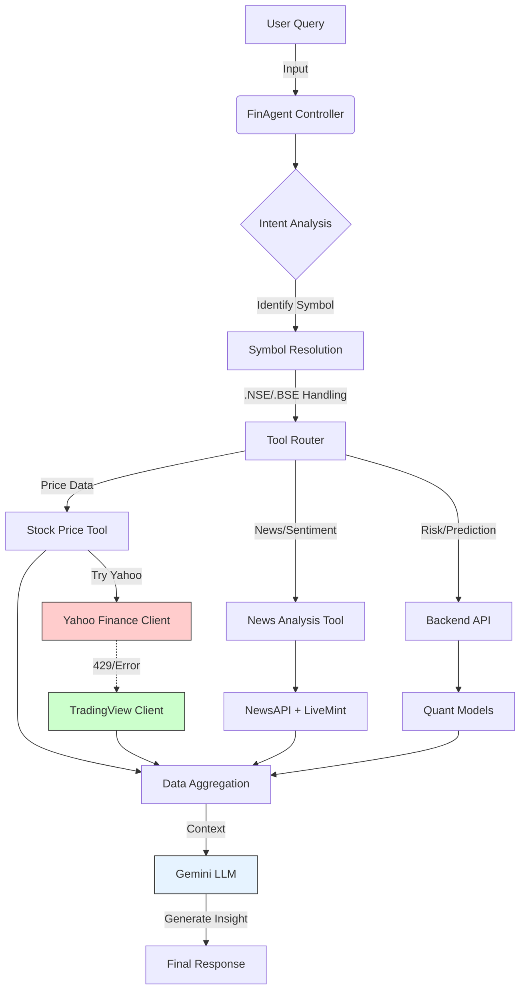

# 📈 Fin-Alpha: AI-Powered Financial Analysis Platform


**Fin-Alpha** is a state-of-the-art financial analysis agent that combines real-time market data, advanced risk metrics, and Generative AI to provide actionable investment insights.

> **🚀Powered by Google Gemini**

## ✨ Key Features

*   **🤖 Agentic Interface**: Chat naturally with `FinAgent` to analyze stocks, ask for recommendations, and get explained insights.
*   **📊 Comprehensive Analysis**:
    *   **Real-time Data**: Hybrid fetching via Yahoo Finance and TradingView (Unofficial) for robustness.
    *   **Technical Indicators**: RSI, MACD, Bollinger Bands, Moving Averages.
    *   **Fundamental Data**: P/E, Market Cap, EPS, Sector comparison.
*   **⚖️ Risk Intelligence**:
    *   Value at Risk (VaR) & CVaR calculations.
    *   Volatility analysis & Anomaly detection.
    *   Sharpe & Sortino ratios.
*   **🔮 Predictive Models**:
    *   Price forecasting using EMA and Linear Regression.
    *   Market Making quotes (Avellaneda-Stoikov model).
*   **📰 News & Sentiment**:
    *   Aggregated news from NewsAPI and LiveMint.
    *   AI-driven sentiment scoring and theme extraction.

## 🛠️ Tech Stack

*   **Backend**: FastAPI, Uvicorn
*   **AI/LLM**: Google Gemini (via `google-generativeai`), LangGraph for agent orchestration.
*   **Data**: `yfinance`, `tradingview-ta`, `newsapi-python`.
*   **Analysis**: `pandas`, `numpy`, `scipy`.

## 🔄 Execution Flow



## 🚀 Getting Started

### Prerequisites

*   Python 3.8+
*   A Google Cloud Project with Gemini API access.

### Installation

1.  **Clone the repository**:
    ```bash
    git clone https://github.com/yourusername/fin-alpha.git
    cd fin-alpha
    ```

2.  **Set up the environment**:
    The project includes a helper script `finalpha` to automate setup.
    ```bash
    ./finalpha
    ```
    *Alternatively, manually:*
    ```bash
    python3 -m venv venv
    source venv/bin/activate
    pip install -r requirements.txt
    ```

3.  **Configure Environment Variables**:
    Create a `.env` file (automatically created by `finalpha` or copy `.env.example`):
    ```ini
    GEMINI_API_KEY=your_gemini_api_key_here
    NEWS_API_KEY=your_newsapi_key_here (Optional)
    ALLOWED_ORIGINS=http://localhost:3000,http://localhost:8000
    ```

## 🖥️ Usage

### Running the Agent (CLI)
Start the interactive financial agent:
```bash
./finalpha
# OR
python agents/run.py
```

**Example Queries:**
*   *"Analyze the stock of Reliance"*
*   *"What is the risk profile of Tesla?"*
*   *"Compare HDFC Bank and ICICI Bank"*
*   *"Get me the latest news for Apple"*
*   *"Predict the price of Bitcoin"*

### Running the Backend API
Start the FastAPI server for the REST API:
```bash
uvicorn backend.app:app --reload
```
API Documentation will be available at: `http://localhost:8000/docs`

## 🧩 Project Structure

```
fin-alpha/
├── LICENSE
├── README.md
├── requirements.txt
├── .env.example
├── agents/
│   ├── __init__.py
│   ├── agent.py
│   ├── config.py
│   ├── run.py
│   ├── state.py
│   ├── tools.py
│   ├── clients/
│   │   ├── __init__.py
│   │   ├── backend_client.py
│   │   ├── mint_client.py
│   │   ├── news_api.py
│   │   ├── tradingview_client.py
│   │   └── yahoo_client.py
│   └── prompts/
│       ├── __init__.py
│       ├── agent_prompts.py
│       ├── subagent_prompts.py
│       ├── synthesis_prompts.py
│       └── system_prompts.py
├── backend/
│   ├── __init__.py
│   ├── analyze.py
│   ├── app.py
│   ├── config.py
│   ├── gemini_helper.py
│   ├── market_maker.py
│   ├── mint.py
│   ├── models.py
│   ├── price_prediction.py
│   ├── risk_analysis.py
│   └── summarizer.py
├── static/
│   └── favicon.svg
```

## ⚠️ Disclaimer

This tool is for **educational and research purposes only**. It does not constitute financial advice. Always do your own due diligence before making investment decisions.

---
Built with ❤️ by Shreyas Pandey
