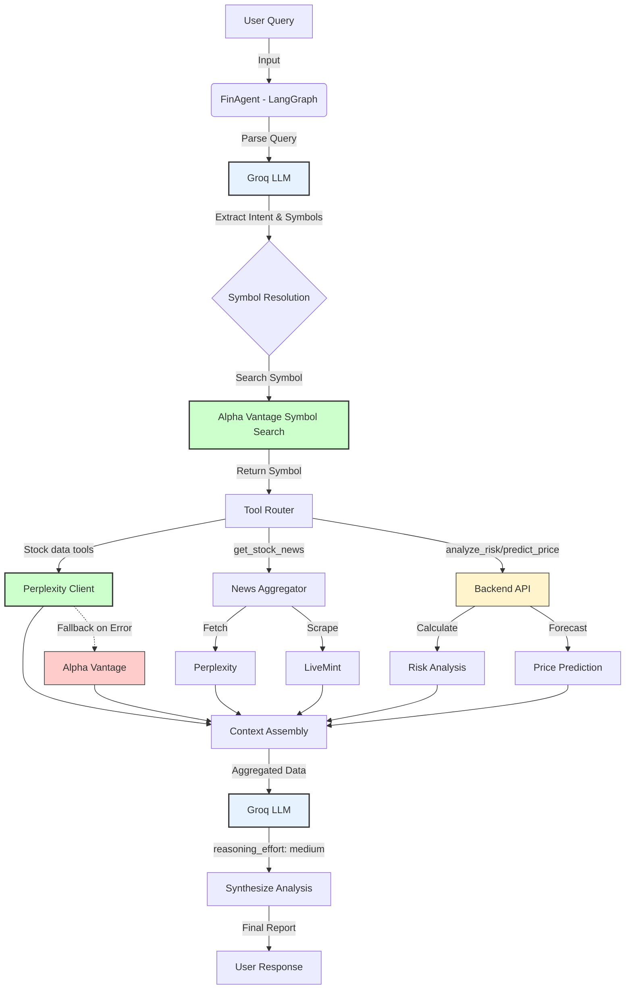

# 📈 Fin-Alpha: AI-Powered Financial Analysis Platform


**Fin-Alpha** is a state-of-the-art financial analysis agent that combines real-time market data, advanced risk metrics, and Generative AI to provide actionable investment insights.

> **🚀 Powered by Groq+GPT-oss-20b**

## ✨ Key Features

* **🤖 Agentic Interface**: Chat naturally with `FinAgent` to analyze stocks, ask for recommendations, and get explained insights.
* **📊 Comprehensive Analysis**:
  * **Real-time Data**: Perplexity-grounded stock/news retrieval with Alpha Vantage fallback for robustness.
  * **Technical Indicators**: RSI, MACD, Bollinger Bands, Moving Averages.
  * **Fundamental Data**: P/E, Market Cap, EPS, Sector comparison.
* **⚖️ Risk Intelligence**:
  * Value at Risk (VaR) & CVaR calculations.
  * Volatility analysis & Anomaly detection.
  * Sharpe & Sortino ratios.
* **🔮 Predictive Models**:
  * Price forecasting using EMA and Linear Regression.
  * Market Making quotes (Avellaneda-Stoikov model).
* **📰 News & Sentiment**:
  * Aggregated news from Perplexity, NewsAPI and LiveMint.
  * AI-driven sentiment scoring and theme extraction.
* **📄 Export Capabilities**:
  * PDF report generation for analysis results.

## 🛠️ Tech Stack

* **Backend**: FastAPI, Uvicorn, Pydantic
* **AI/LLM**: Groq API (`openai/gpt-oss-20b`), LangGraph for agent orchestration
* **Data Sources**: 
  * `Perplexity API` (Primary stock/news grounding)
  * `Alpha Vantage` (Market data fallback)
  * `NewsAPI` (News aggregation)
  * `LiveMint RSS` (Indian market news)
* **Analysis**: `pandas`, `numpy`, `scipy`, `reportlab` (PDF export)
* **CLI**: `typer`, `rich`, `prompt-toolkit`

## 🔄 Execution Flow



## 🚀 Getting Started

### Prerequisites

* Python 3.8+
* A Groq API key (get one at [console.groq.com](https://console.groq.com))

### Installation

1. **Clone the repository**:

   ```bash
   git clone https://github.com/yourusername/fin-alpha.git
   cd fin-alpha
   ```
2. **Set up the environment**:
   The project includes a launcher script `main.py` to automate setup and run both backend and agent.

   ```bash
   python3 main.py
   ```

   *Alternatively, manually:*

   ```bash
   python3 -m venv venv
   source venv/bin/activate
   pip install -r requirements.txt
   ```
3. **Configure Environment Variables**:
   Create a `.env.local` file:

   ```ini
   GROQ_API_KEY=your_groq_api_key_here
   GROQ_MODEL=openai/gpt-oss-20b
   PERPLEXITY_API_KEY=your_perplexity_api_key_here
   PERPLEXITY_MODEL=sonar
   ALPHAVANTAGE_API_KEY=your_alpha_vantage_api_key_here
   NEWSAPI_KEY=your_newsapi_key_here
   BACKEND_URL=http://localhost:8000
   LLM_TEMPERATURE=1
   MAX_TOKENS=2048
   ```

## 🖥️ Usage

### Running the Agent (CLI)

Start the interactive financial agent:

```bash
python3 main.py
# OR
python3 agents/run.py
```

**Example Queries:**

* *"Analyze the stock of Reliance"*
* *"What is the risk profile of Tesla?"*
* *"Compare HDFC Bank and ICICI Bank"*
* *"Get me the latest news for Apple"*
* *"Predict the price of SBI"*

### Running the Backend API

Start the FastAPI server for the REST API:

```bash
uvicorn backend.app:app --reload
```

API Documentation will be available at: `http://localhost:8000/docs`

### API Endpoints

The backend provides REST APIs for various financial analysis functions:

- `GET /api/health` - Health check
- `POST /api/search-analysis` - Comprehensive stock analysis
- `POST /api/analyze-news` - News sentiment analysis
- `POST /api/analyze-chart` - Technical chart analysis
- `POST /api/summarize-news` - News summarization
- `POST /api/risk-analysis` - Risk metrics calculation
- `POST /api/predict-price` - Price prediction (EMA/Linear Regression)
- `POST /api/market-maker/quote` - Market maker bid/ask quotes
- `POST /api/groq-query` - Direct Groq LLM queries

## 🧩 Project Structure

```
fin-alpha/
├── LICENSE
├── README.md
├── main.py            # Launcher script for backend + agent
├── requirements.txt
├── .env.example       # Environment variables template
├── .env.local         # Local environment configuration
├── agents/
│   ├── __init__.py
│   ├── agent.py          # Main LangGraph agent
│   ├── config.py         # Agent configuration
│   ├── run.py            # CLI entry point
│   ├── state.py          # Agent state definition
│   ├── tools.py          # LangChain tools
│   ├── pdf_exporter.py   # PDF report generation
│   ├── clients/
│   │   ├── __init__.py
│   │   ├── alphavantage_client.py
│   │   ├── backend_client.py
│   │   ├── mint_client.py
│   │   ├── news_api.py
│   │   └── perplexity_client.py
│   └── prompts/
│       ├── __init__.py
│       ├── agent_prompts.py
│       ├── subagent_prompts.py
│       ├── synthesis_prompts.py
│       ├── system_prompts.py
│       └── tools_prompts.py
├── backend/
│   ├── __init__.py
│   ├── app.py            # FastAPI application
│   ├── config.py         # Backend configuration
│   ├── groq_helper.py    # Groq API helper
│   ├── market_maker.py   # Market making models
│   ├── mint.py           # LiveMint scraper
│   ├── models.py         # Pydantic models
│   ├── price_prediction.py
│   └── risk_analysis.py
├── static/
│   └── favicon.svg
```

## ⚠️ Disclaimer

This tool is for **educational and research purposes only**. It does not constitute financial advice. Always do your own due diligence before making investment decisions.

Built with ❤️ by Shreyas Pandey
